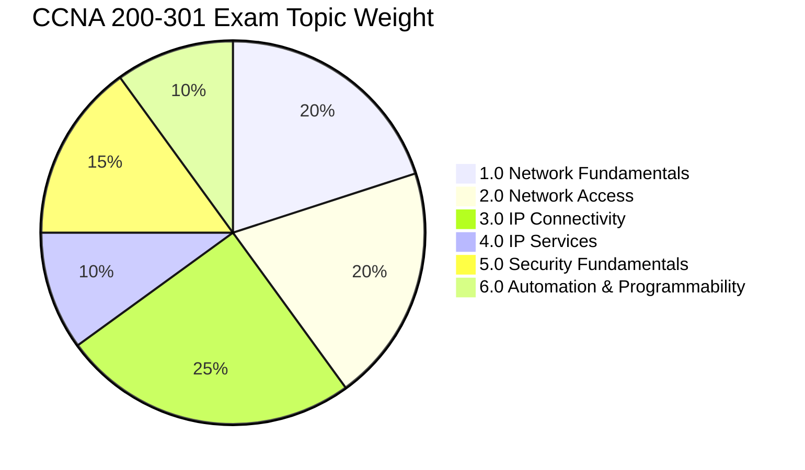

# 🚀 Cisco CCNA 200-301 Exam Simulator & Question Bank

<div align="center">


<br/>

**An enterprise-grade, realistic Cisco CCNA 200-301 practice and examination simulator featuring verified questions, high-resolution topology exhibits, interactive Drag & Drop questions, and Boson-style performance analytics.**

[Live Demo](https://yasirraheel.github.io/ccna-dumps/) • [Features](#-key-features) • [Exam Banks](#-exam-banks--coverage) • [Quick Start](#-quick-start) • [Architecture](#-architecture)

</div>

---

## 🌟 Key Features

### 🖥️ High-Fidelity Exam Simulation UI
- **Boson ExSim & Cisco Pearson VUE Style**: Dark executive theme crafted for long study sessions with high contrast, legible typography, and intuitive navigation.
- **2 Practice Modes**:
  - 📖 **Study Mode**: Instant answer feedback, full explanations, show answer toggles, and untimed learning.
  - ⏱️ **Exam Mode**: Strict 120-minute timer countdown, hidden answers until finish, realistic exam conditions.

### 🧩 Interactive Drag & Drop Engine
- **Visual Target Matching**: Interactive drag-and-drop / click-to-place items for routing protocols, AAA concepts, QoS classifications, and subnet masks.
- **Comprehensive Review**: Visual match confirmation and instant reset options.

### 🖼️ Topology & IOS CLI Exhibits
- **69 High-Resolution Exhibits**: Packet tracer diagrams, network topologies, WLC GUI configurations, and routing tables.
- **Click-to-Zoom Exhibit Modal**: Inspect complex network exhibits with a dedicated high-resolution viewer.
- **Embedded Cisco IOS CLI Snippets**: Realistic interface outputs, routing tables (`show ip route`), and switchport configurations.

### ⚙️ Customizable Exam Settings
- **Question Ordering**: 
  - 📄 **Original Source**: Preserves exact 1:1 page sequence matching the source dump PDFs (1 → 207, D&D 1 → 21) for side-by-side verification.
  - 🔀 **Randomize**: Shuffles questions for unpredictable, realistic exam trials.
- **Timer Customization**: Untimed, 60 minutes, 90 minutes, or the official 120 minutes CCNA standard.
- **Inline Answers & Feedback**: Toggle instant explanation visibility during practice.

### 💾 Auto-Save & Instant Resume
- Never lose progress: active sessions auto-save on every answer change.
- Pick up right where you left off from the dashboard with one click.
- Confirmation dialogues protect you from accidentally discarding in-progress sessions.

### 📊 Executive Score Report & Exam History
- **82.5% Passing Score Benchmark**: Assessed against the Cisco CCNA standard.
- **Full-Width Analytics Dashboard**: 4-column metric grid (Score, Percentage, Pass/Fail, Time Spent) and Boson score progress bar.
- **Targeted Retake Actions**:
  - 🔍 **Review Exam (Read-Only)**: Inspect past attempts without altering submitted answers.
  - ↺ **Retake All Questions**
  - ⚑ **Retake Flagged Only**
  - ✕ **Retake Incorrect Only**

### 💬 In-Exam Question Notes & AI Export
- Attach persistent personal notes to any question during testing.
- Export all notes with one click via **`📋 Copy All Notes for AI`** to generate custom review summaries.

---

## 📚 Exam Banks & Coverage

The question bank consists of **228 fully verified questions** matching the original source dump PDFs:

| Exam Bank | Question Count | Range / Type | Focus Areas |
|---|:---:|:---:|---|
| **Exam A** | 50 Qs | `#1 – #50` | Network Fundamentals, SDN Architecture, QoS, Wireless Modes |
| **Exam B** | 50 Qs | `#51 – #100` | IP Connectivity, OSPFv2, Routing Logic, VLANs, Trunking |
| **Exam C** | 50 Qs | `#101 – #150` | IP Services, DHCP Relay, NAT/PAT, ACL Placement & Rules |
| **Exam D** | 57 Qs | `#151 – #207` | Security Fundamentals, Port Security, Automation, REST APIs |
| **Drag & Drop Special** | 21 Qs | `D&D #1 – #21` | Protocol Comparisons, Subnetting, QoS, Cloud vs On-Prem |
| **All Questions** | **228 Qs** | Full Bank | Complete Cisco Certified Network Associate Comprehensive Practice |

---

## 🎯 CCNA 200-301 Domains Covered



- **1.0 Network Fundamentals (20%)**: IPv4/IPv6 Subnetting, OSI vs TCP/IP models, Cabling & Interfaces, Two-Tier Collapsed Core vs Three-Tier Spine-and-Leaf.
- **2.0 Network Access (20%)**: VLANs & 802.1Q trunking, STP/RSTP/PortFast, EtherChannel (LACP/PAgP), Cisco WLC & CAPWAP.
- **3.0 IP Connectivity (25%)**: Longest Prefix Match, Administrative Distance, Static/Floating routes, OSPFv2 metrics & states.
- **4.0 IP Services (10%)**: DHCP Relay (`ip helper-address`), PAT (NAT Overload), SNMPv3, NTP, Syslog, DNS.
- **5.0 Security Fundamentals (15%)**: Standard/Extended ACLs, Port Security (protect, restrict, shutdown), DHCP Snooping & Dynamic ARP Inspection (DAI).
- **6.0 Automation & Programmability (10%)**: REST APIs (GET, POST, PUT, DELETE), JSON formatting, Cisco DNA Center / Catalyst Center, Configuration Management (Ansible, Puppet, Chef).

---

## 🚀 Quick Start

### Prerequisites
- [Node.js](https://nodejs.org/) (v16 or higher)
- [npm](https://www.npmjs.com/) (v8 or higher)
- *(Optional)* [MySQL Server](https://www.mysql.com/) for centralized backend progress sync

### 1. Clone the Repository
```bash
git clone https://github.com/yasirraheel/ccna-dumps.git
cd ccna-dumps
```

### 2. Install Dependencies
```bash
npm install
```

### 3. Start the Frontend App
```bash
npm start
```
The simulator will launch at **`http://localhost:3000/React-QuizApp`** (or `http://localhost:3000`).

---

### 🗄️ Optional: Run with MySQL Backend Sync

To synchronize attempts and questions to a MySQL database:

1. Configure environment variables in `server/.env` or export them:
   ```env
   DB_HOST=localhost
   DB_USER=root
   DB_PASSWORD=your_password
   DB_PORT=3306
   DB_NAME=ccna_exam_db
   PORT=5000
   ```

2. Start the backend server:
   ```bash
   node server/index.js
   ```

---

## 📂 Project Structure

```
ccna-dumps/
├── public/
│   ├── exhibits/               # 69 high-res network diagrams & topology exhibits
│   ├── favicon-32x32.png       # Cisco certification branding icons
│   ├── index.html              # HTML document template
│   └── manifest.json           # PWA / web application manifest
├── server/
│   ├── db.js                   # MySQL connection pool, auto-migration & seed logic
│   └── index.js                # Express API endpoints for questions and progress sync
├── src/
│   ├── components/
│   │   ├── App.js              # Root state manager, reducer & exam coordinator
│   │   ├── CustomConfirmModal.js# Accessible confirmation modal for destructive actions
│   │   ├── DragDropQuestion.js # Interactive drag & drop question component
│   │   ├── ExamDashboard.js    # Home dashboard with bank selection & quick resume
│   │   ├── ExamHistoryView.js  # Full-width past exams score dashboard
│   │   ├── ExamSettingsModal.js# Question ordering & timer settings dialog
│   │   ├── FinishScreen.js     # Score breakdown report & performance analysis
│   │   ├── Header.js           # Top navigation bar with branding & active badges
│   │   ├── NavigationMenu.js   # Section navigation toolbar
│   │   ├── QuestionNav.js      # Bottom question navigation & instant action buttons
│   │   ├── QuestionNotesModal.js# Sticky notes manager with clipboard AI exporter
│   │   ├── QuestionPaletteModal.js# 228-question quick-jump matrix grid
│   │   └── QuestionView.js     # Multiple-choice exam interface with exhibit modal
│   ├── data/
│   │   └── ccnaQuestions.js    # 228 verified questions dataset in original source order
│   ├── index.css               # Boson ExSim dark theme styling system
│   └── index.js                # React DOM root entrypoint
├── package.json
└── README.md
```

---

## ⌨️ Useful Scripts

| Command | Description |
|---|---|
| `npm start` | Runs the React frontend app in development mode on port 3000 |
| `npm run build` | Builds the optimized production bundle into the `build/` directory |
| `node server/index.js` | Starts the optional Express/MySQL API server on port 5000 |

---

## 🤝 Contributing

Contributions, question refinements, and explanations additions are welcome!
1. Fork the repository
2. Create your feature branch (`git checkout -b feature/new-question-feature`)
3. Commit your changes (`git commit -m 'Add new question explanations'`)
4. Push to the branch (`git push origin feature/new-question-feature`)
5. Open a Pull Request

---

## 📄 License

This project is open source and available under the [MIT License](LICENSE).

<div align="center">
  <sub>Built with ❤️ for CCNA candidates worldwide. Good luck on your exam! 🎓</sub>
</div>
